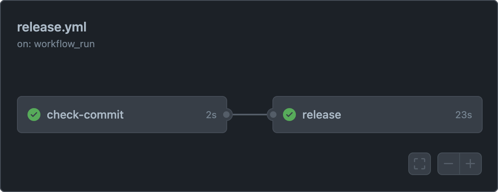

There are many tools available to automate the release process for npm packages, such as [lerna-lite](https://github.com/lerna-lite/lerna-lite) for monorepos, [Release It!](https://github.com/release-it/release-it) for single packages etc. They can be used to automatically bump the version and generate changelog based on the commit messages using [Conventional Commits](https://www.conventionalcommits.org/en/v1.0.0/), create a GitHub release, create a git tag, and publish the package to npm etc.

Generally, the release process is triggered manually by running a command on local machine. But automating the release process on GitHub Actions can be more convenient.

This guide documents how to configure GitHub Actions to automatically release npm packages on every commit using `release-it`. However, these steps can be adapted to other similar tools as well.

## Step 1

Install `release-it` and `@release-it/conventional-changelog` as dev dependencies:

```bash
yarn add --dev release-it @release-it/conventional-changelog
```

Configure `release-it` in the `package.json` file:

```js title="package.json"
{
  ...
  "release-it": {
    "git": {
      "commitMessage": "chore: release ${version}",
      "tagName": "v${version}"
    },
    "npm": {
      "publish": true
    },
    "github": {
      "release": true
    },
    "plugins": {
      "@release-it/conventional-changelog": {
        "preset": {
          "name": "conventionalcommits"
        },
        "infile": "CHANGELOG.md"
      }
    }
  },
  ...
}
```

## Step 2

Create a NPM token with publish access. You can create one at `https://www.npmjs.com/settings/[username]/tokens` (replace `[username]` with your username):

- Click on **"Generate New Token"** and select **"Granular Access Token"**
- Provide a token name and expiration date
- Under **"Packages and scopes"**, select **"Read and write"** for permissions
- Then select **"Only select packages and scopes"** and select the package you want to publish
- Click **"Generate token"** and copy the token

Then the token needs to be added as a secret in the GitHub repository:

- Go to the repository and click on **"Settings"**
- Click on **"Secrets and variables"** and choose **"Actions"**
- Click **"New repository secret"** and add the token as `NPM_PUBLISH_TOKEN`
- Click on **"Add secret"** to save the token

This token will be used to authenticate with NPM to publish the package.

> [!WARNING]
> Other collaborators on the repo can push actions that use this token and update the npm package acting as the user associated with the token. Make sure to use this only if you trust the collaborators on the repository.

## Step 3

Create a GitHub personal access token. You can create one at [github.com/settings/personal-access-tokens/new](https://github.com/settings/personal-access-tokens/new):

- Provide name, description, and expiration date as per your preference
- Under **"Repository access"**, select **"Only select repositories"** and choose the repositories you want to set up the release workflow for
- Under **"Permissions**", expand **"Repository permissions"** and set **"Contents"** to **"Access: Read & write"**
- Click **"Generate token"** and copy the generated token

Alternatively, you can create a classic token with the `repo` scope [under **Developer settings** in your profile settings](https://github.com/settings/tokens/new?scopes=repo&description=release-it). However, it is highly recommended to use granular access tokens with the least required permissions.

Then the token needs to be added as a secret in the GitHub repository:

- Go to the repository and click on **"Settings"**
- Click on **"Secrets and variables"** and choose **"Actions"**
- Click **"New repository secret"** and add the token as `PERSONAL_ACCESS_TOKEN`
- Click on **"Add secret"** to save the token

A personal access token is necessary to be able to push the changes back to the repository if the release branch is protected. The user associated with the token needs to have admin access to the repository and be able to bypass branch protection rules.

> [!WARNING]
> Other collaborators on the repo can push actions that use this token and push commits acting as the user associated with the token. Make sure to use this only if you trust the collaborators on the repository.

If there are no branch protection rules in the repository, then the [`GITHUB_TOKEN`](https://docs.github.com/en/actions/concepts/security/github_token) secret can be used instead of a personal access token. Note that commits made by using `GITHUB_TOKEN` won't trigger other workflows.

## Step 4

Create a GitHub Actions workflow file in `.github/workflows/release.yml` with the following contents:

```yml title=".github/workflows/release.yml"
name: Release package
on:
  workflow_run:
    branches:
      - main
    workflows:
      # List of workflows that runs tests, linting, etc.
      # This ensures that the release is only triggered when the tests pass.
      - CI
    types:
      - completed

jobs:
  check-commit:
    runs-on: ubuntu-latest
    # Skip if the workflow run for tests, linting etc. is not successful
    # Without this, the release will be triggered after the previous workflow run even if it failed.
    if: ${{ github.event.workflow_run.conclusion == 'success' }}
    outputs:
      skip: ${{ steps.commit-message.outputs.skip }}
    steps:
      - name: Checkout
        uses: actions/checkout@v3

      # Check if the commit message is a release commit
      # Without this, there will be an infinite loop of releases
      - name: Get commit message
        id: commit-message
        run: |
          MESSAGE=$(git log --format=%B -n 1 $(git log -1 --pretty=format:"%h"))

          if [[ $MESSAGE == "chore: release "* ]]; then
            echo "skip=true" >> $GITHUB_OUTPUT
          fi

  release:
    runs-on: ubuntu-latest
    needs: check-commit
    permissions:
      contents: read
      id-token: write
    # Skip if the commit message is a release commit
    if: ${{ needs.check-commit.outputs.skip != 'true' }}
    steps:
      - name: Checkout
        uses: actions/checkout@v3
        with:
          # This is needed to generate the changelog from commit messages
          fetch-depth: 0
          token: ${{ secrets.PERSONAL_ACCESS_TOKEN }}

      - name: Setup Node.js
        uses: actions/setup-node@v3

      - name: Install dependencies
        run: yarn install --immutable
        shell: bash

      - name: Configure Git
        run: |
          git config user.name "${GITHUB_ACTOR}"
          git config user.email "${GITHUB_ACTOR}@users.noreply.github.com"

      - name: Create release
        run: |
          npm config set //registry.npmjs.org/:_authToken $NPM_TOKEN
          yarn release-it --ci
        env:
          GITHUB_TOKEN: ${{ secrets.PERSONAL_ACCESS_TOKEN }}
          NPM_TOKEN: ${{ secrets.NPM_PUBLISH_TOKEN }}
          NPM_CONFIG_PROVENANCE: true
```

There are 2 important things to note in this workflow:

- The workflow runs on the `workflow_run` event. This event is triggered when another workflow is run. In this case, the `CI` workflow is run on every commit to the `main` branch. The `release` workflow is triggered when the `CI` workflow is completed. You may need to change the name according to the name of the workflow that runs tests, linting, etc. in your repository.
- There are 2 jobs in the workflow. The first job checks if the commit message is a release commit. If it is, then the second job is skipped. This is to prevent an infinite loop of releases. The second job runs `release-it` to publish the package.

Additionally, setting `NPM_CONFIG_PROVENANCE` to `true` will generate a [provenance statement](https://docs.npmjs.com/generating-provenance-statements) when publishing the package. This lets others verify where and how your package was built. This also needs the `id-token: write` permission in the `permissions` section of the job.

After configuring, this workflow automatically publishes a new version of the package on every commit to the `main` branch after the `CI` workflow is successful.



Instead of publishing on every commit, an alternative way could be to have the release workflow configured, and run the workflow manually from the **Actions** tab in the repository when a new release is needed. This can be done by using the `workflow_dispatch` event to the `on` section:

```yml title=".github/workflows/release.yml"
name: Release package
on:
  workflow_dispatch:

jobs:
  release:
    runs-on: ubuntu-latest
    steps:
      # Same steps as before
```

See the GitHub documentation for [Manually running a workflow](https://docs.github.com/en/actions/using-workflows/manually-running-a-workflow) for more details.
