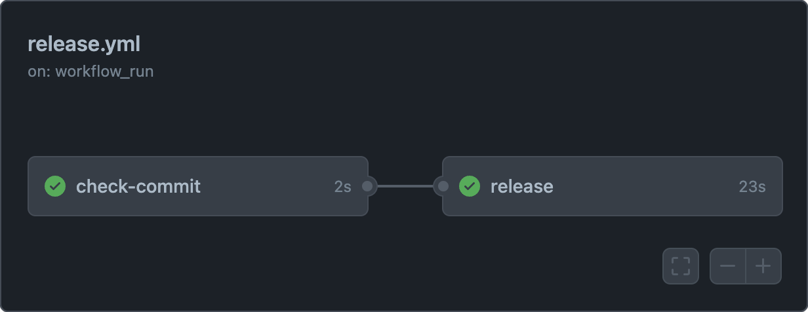

There are many tools available to automate the release process for npm packages, such as [lerna-lite](https://github.com/lerna-lite/lerna-lite) for monorepos, [Release It!](https://github.com/release-it/release-it) for single packages etc. They can be used to automatically bump the version and generate changelog based on the commit messages using [Conventional Commits](https://www.conventionalcommits.org/en/v1.0.0/), create a GitHub release, create a git tag, and publish the package to npm etc.

Generally, the release process is triggered manually by running a command on local machine. But automating the release process on GitHub Actions can be more convenient.

This guide documents how to configure GitHub Actions to automatically release npm packages on every commit using `release-it`. However, these steps can be adapted to other similar tools as well.

## Setting up workflows

### Step 1: Configure `release-it`

Install `release-it` and `@release-it/conventional-changelog` as dev dependencies:

```bash
npm install --save-dev release-it @release-it/conventional-changelog
```

Configure `release-it` in the `package.json` file:

```js title="package.json"
{
  ...
  "release-it": {
    "git": {
      "commitMessage": "chore: release ${version}",
      "tagName": "v${version}"
    },
    "npm": {
      "publish": true,
      "skipChecks": true
    },
    "github": {
      "release": true
    },
    "plugins": {
      "@release-it/conventional-changelog": {
        "preset": {
          "name": "conventionalcommits"
        },
        "infile": "CHANGELOG.md"
      }
    }
  },
  ...
}
```

The `npm.skipChecks` option is set to `true` to skip authentication checks done by `release-it`, since it will be handled by GitHub Actions using "Trusted Publisher". Not setting this option will lead to authentication error when running the release workflow.

### Step 2: Set up npm authentication

Set up your GitHub workflow as a "Trusted Publisher" on npm. You need to do it for each package at `https://www.npmjs.com/package/[package-name]/access` (replace `[package-name]` with your package name):

- Select **"GitHub Actions"** under **"Trusted Publishers"**
- Fill in the organization and repository name
- Fill in the workflow file path, in our case we will use [`release.yml`](#step-4)

This allows you to publish packages using [OpenID Connect (OIDC)](https://openid.net/developers/how-connect-works/) authentication without needing an npm token.

<details>
<summary>Legacy setup with npm token</summary>

It is recommended to use the trusted publisher feature if possible instead of npm tokens for better security. In addition, [npm tokens are only valid for 90 days](https://github.blog/changelog/2025-11-05-npm-security-update-classic-token-creation-disabled-and-granular-token-changes/), making it quite inconvenient for automated workflows.

To use npm tokens for authentication instead, create a npm token with publish access. You can create one at `https://www.npmjs.com/settings/[username]/tokens` (replace `[username]` with your username):

- Click on **"Generate New Token"** and select **"Granular Access Token"**
- Provide a token name and expiration date
- Under **"Packages and scopes"**, select **"Read and write"** for permissions
- Then select **"Only select packages and scopes"** and select the package you want to publish
- Click **"Generate token"** and copy the token

Then the token needs to be added as a secret in the GitHub repository:

- Go to the repository and click on **"Settings"**
- Click on **"Secrets and variables"** and choose **"Actions"**
- Click **"New repository secret"** and add the token as `npm_PUBLISH_TOKEN`
- Click on **"Add secret"** to save the token

This token will be used to authenticate with npm to publish the package.

> [!WARNING]
> Other collaborators on the repo can push actions that use this token and update the npm package acting as the user associated with the token. Make sure to use this only if you trust the collaborators on the repository.

</details>

### Step 3: Set up GitHub token

Create a GitHub personal access token. You can create one at [github.com/settings/personal-access-tokens/new](https://github.com/settings/personal-access-tokens/new):

- Provide name, description, and expiration date as per your preference
- Under **"Repository access"**, select **"Only select repositories"** and choose the repositories you want to set up the release workflow for
- Under **"Permissions**", expand **"Repository permissions"** and set **"Contents"** to **"Access: Read & write"**
- Click **"Generate token"** and copy the generated token

<details>
<summary>Legacy setup with classic token</summary>

Alternatively, you can create a classic token with the `repo` scope [under **Developer settings** in your profile settings](https://github.com/settings/tokens/new?scopes=repo&description=release-it). However, it is highly recommended to use granular access tokens with the least required permissions for better security.

</details>

Then the token needs to be added as a secret in the GitHub repository. We'll set up [environments](https://docs.github.com/en/actions/how-tos/deploy/configure-and-manage-deployments/manage-environments) so we can restrict the token to be used only on the `main` branch:

- Go to the repository and click on **"Settings"**
- Click on **"Environments"**
- Click **"New environment"** and give it a name, we'll use `release` for this example
- Click **"Configure environment"**
- Under **"Deployment branches and tags"**, select **"Selected branches and tags"**
- Click **"Add deployment branch or tag rule"**, set **"Ref type"** to **"Branch"** and enter `main` as the value under **"Name pattern"**, then click **"Add rule"**
- Under **"Environment secrets"**, click **"Add environment secret"** and add the token as `PERSONAL_ACCESS_TOKEN`
- Click on **"Add secret"** to save the token

<details>
<summary>Setup without environments</summary>

Environments are not available on private repositories on the free plan. So in this case, you can add the token as a repository secret without setting up environments:

- Go to the repository and click on **"Settings"**
- Click on **"Secrets and variables"** and choose **"Actions"**
- Click **"New repository secret"** and add the token as `PERSONAL_ACCESS_TOKEN`
- Click on **"Add secret"** to save the token

Note that this means the token can be used in workflows running on any branch, even for the ones created by other collaborators.

</details>

A personal access token is necessary to push the release commit and tag back to the repository if the release branch is protected. The user associated with the token needs to have admin access to the repository and be able to bypass branch protection rules.

> [!WARNING]
> Anyone who can push workflow changes to the repository can make a workflow use this token. Package scripts and compromised dependencies running in the release workflow can also access it. To minimize risk, scope it to this repository with the minimum required permissions, and prefer a dedicated bot account with an expiration date and regular rotation.

If there are no branch protection rules in the repository, then the [`GITHUB_TOKEN`](https://docs.github.com/en/actions/concepts/security/github_token) secret (available by default) can be used instead of a personal access token. Note that commits made by using `GITHUB_TOKEN` won't trigger other workflows.

### Step 4: Configure GitHub Actions

Create a GitHub Actions workflow file in `.github/workflows/release.yml` with the following contents:

```yml title=".github/workflows/release.yml"
name: Release package
on:
  workflow_run:
    branches:
      - main
    workflows:
      # List of workflows that runs tests, linting, etc.
      # This ensures that the release is only triggered when the tests pass.
      - CI
    types:
      - completed

jobs:
  check-commit:
    runs-on: ubuntu-latest
    # Only run for successful pushes from this repository.
    # - Skip failed runs of the previous workflow, otherwise the release will be triggered even if tests, linting etc. failed.
    # - Skip runs not triggered by a push (e.g. pull_request, schedule), otherwise a fork's pull request could trigger a release.
    # - Skip runs from forks, otherwise a fork branch named "main" could match the `branches` filter and trigger a release.
    if: >-
      github.event.workflow_run.conclusion == 'success' &&
      github.event.workflow_run.event == 'push' &&
      github.event.workflow_run.head_repository.full_name == github.repository
    outputs:
      skip: ${{ steps.commit-message.outputs.skip }}
    steps:
      - name: Checkout
        # actions/checkout@v6.0.2
        uses: actions/checkout@de0fac2e4500dabe0009e67214ff5f5447ce83dd

      # Check if the commit message is a release commit
      # Without this, there will be an infinite loop of releases
      - name: Get commit message
        id: commit-message
        run: |
          MESSAGE=$(git log --format=%B -n 1 $(git log -1 --pretty=format:"%h"))

          if [[ $MESSAGE == "chore: release "* ]]; then
            echo "skip=true" >> $GITHUB_OUTPUT
          fi

  release:
    runs-on: ubuntu-latest
    needs: check-commit
    permissions:
      contents: read
      id-token: write
    environment:
      name: release
      url: https://www.npmjs.com/package/[package-name] # replace with your package url
    # Skip if the commit message is a release commit
    if: ${{ needs.check-commit.outputs.skip != 'true' }}
    steps:
      - name: Checkout
        # actions/checkout@v6.0.2
        uses: actions/checkout@de0fac2e4500dabe0009e67214ff5f5447ce83dd
        with:
          # This is needed to generate the changelog from commit messages
          fetch-depth: 0
          token: ${{ secrets.PERSONAL_ACCESS_TOKEN }}

      - name: Setup Node.js
        # actions/setup-node@v6.4.0
        uses: actions/setup-node@48b55a011bda9f5d6aeb4c2d9c7362e8dae4041e
        with:
          # Avoid using dependency caches in the release job.
          package-manager-cache: false

      # Use a newer version for the trusted publisher feature
      - name: Update npm
        run: npm install -g npm@11.14.1

      - name: Install dependencies
        run: npm ci

      - name: Configure Git
        run: |
          git config user.name "${GITHUB_ACTOR}"
          git config user.email "${GITHUB_ACTOR}@users.noreply.github.com"

      - name: Create release
        run: |
          npm exec -- release-it --ci
        env:
          GITHUB_TOKEN: ${{ secrets.PERSONAL_ACCESS_TOKEN }}
```

There are 2 important things to note in this workflow:

- The workflow runs on the `workflow_run` event. This event is triggered when another workflow is run. In this case, the `CI` workflow is run on every commit to the `main` branch. The `release` workflow is triggered when the `CI` workflow is completed. You may need to change the name according to the name of the workflow that runs tests, linting, etc. in your repository.
- There are 2 jobs in the workflow. The first job checks if the commit message is a release commit. If it is, then the second job is skipped. This is to prevent an infinite loop of releases. The second job runs `release-it` to publish the package.

The "Update npm" step is included to ensure that the latest version of npm is used, which is necessary for the trusted publisher feature.

<details>
<summary>Legacy setup with npm token</summary>

If you are using npm token instead of setting up a trusted publisher, then replace the `Create release` step with the following:

```yml title=".github/workflows/release.yml"
- name: Create release
  run: |
    npm config set //registry.npmjs.org/:_authToken $npm_PUBLISH_TOKEN
    npm exec -- release-it --ci
  env:
    GITHUB_TOKEN: ${{ secrets.PERSONAL_ACCESS_TOKEN }}
    npm_PUBLISH_TOKEN: ${{ secrets.npm_PUBLISH_TOKEN }}
    npm_CONFIG_PROVENANCE: true
```

Setting `npm_CONFIG_PROVENANCE` to `true` will generate a [provenance statement](https://docs.npmjs.com/generating-provenance-statements) when publishing the package. This lets others verify where and how your package was built. This also needs the `id-token: write` permission in the `permissions` section of the job.

You can also remove the "Update npm" step since we only need it to use the trusted publisher feature.

</details>

<details>
<summary>Setup without environments</summary>

If you didn't set up the `PERSONAL_ACCESS_TOKEN` secret using environments, then omit the `environment` block in the workflow file:

```diff title=".github/workflows/release.yml"
   release:
     runs-on: ubuntu-latest
     needs: check-commit
     permissions:
       contents: read
       id-token: write
-    environment:
-      name: release
-      url: https://www.npmjs.com/package/[package-name] # replace with your package url
     # Skip if the commit message is a release commit
     if: ${{ needs.check-commit.outputs.skip != 'true' }}
```

</details>

After configuring, this workflow automatically publishes a new version of the package on every commit to the `main` branch after the `CI` workflow is successful.



> [!NOTE]
> If you're publishing a new package, make sure to publish it from your local machine first. Trusted publishing only works for publishing new versions of existing packages.

Instead of publishing on every commit, an alternative way could be to have the release workflow configured, and run the workflow manually from the **Actions** tab in the repository when a new release is needed. This can be done by using the `workflow_dispatch` event to the `on` section:

```yml title=".github/workflows/release.yml"
name: Release package
on:
  workflow_dispatch:

jobs:
  release:
    runs-on: ubuntu-latest
    steps:
      # Same steps as before
```

See the GitHub documentation for [Manually running a workflow](https://docs.github.com/en/actions/using-workflows/manually-running-a-workflow) for more details.

## Security considerations

Using trusted publishing is safer than storing a long-lived npm publish token in GitHub Actions, but it doesn't make the whole workflow safe by itself.

Here are some recommended practices to minimize the risk:

- Grant `id-token: write` only to the job that publishes to npm. Avoid running unrelated work such as tests, linting etc. in the same job.
- Don't use dependency or build caches in the release job. A poisoned cache can carry compromised code from a less-trusted workflow into the publishing workflow.
- Use a fine-grained repo-scoped GitHub token, preferably from a bot account, with expiration and rotation.
- Avoid `pull_request_target` unless the workflow needs write access for metadata-only tasks such as labeling or commenting on pull requests. Never use it to check out, install, build, test or run code from an untrusted pull request.
- Treat `workflow_run` as privileged. It can access secrets even if the workflow that triggered it could not. For release workflows, check that the triggering run came from a successful `push` to the same repository, and don't use artifacts from untrusted runs as release inputs.
- Pin third-party actions and reusable workflows to full-length commit SHAs instead of tags such as `@v3` or branches such as `@main`.
- Monitor published versions, package contents, and provenance attestations so unexpected publishes are detected quickly.

References:

- [npm trusted publishing](https://docs.npmjs.com/trusted-publishers/)
- [GitHub `pull_request_target` documentation](https://docs.github.com/en/actions/reference/workflows-and-actions/events-that-trigger-workflows#pull_request_target)
- [GitHub Security Lab: Preventing pwn requests](https://securitylab.github.com/resources/github-actions-preventing-pwn-requests/)
- [GitHub secure use reference](https://docs.github.com/en/actions/reference/security/secure-use#using-third-party-actions)
- [TanStack npm supply-chain compromise postmortem](https://tanstack.com/blog/npm-supply-chain-compromise-postmortem)
