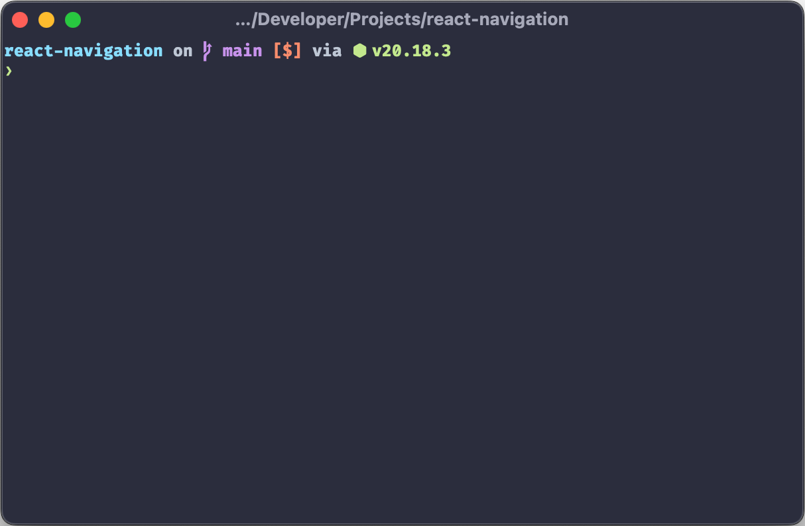

Few years ago, I wrote [Supercharge Your Terminal with Zsh](https://medium.com/call-stack/supercharge-your-terminal-with-zsh-8b369d689770). Since then, I've made a few changes to my Zsh setup. So it's time for an update.

I won't go through the installation process, as it depends on your operating system. So make sure to install it first using your favorite package manager. If you're on MacOS, an older version of `zsh` is pre-installed, so you still may want to install a newer version with [Homebrew](https://brew.sh/) or another package manager.

To make Zsh your default shell, run:

```bash
chsh -s $(which zsh)
```

Now we're ready to configure Zsh by editing the `~/.zshrc` file.

If you want to see my full Zsh configuration, jump to the [Wrapping Up](#wrapping-up) section.

## Why not Oh My Zsh?

One of the most popular Zsh frameworks is [Oh My Zsh](https://ohmyz.sh/). It's an easy way to have a great Zsh setup with a lot of plugins and themes. However, it adds a lot of things that I don't need. All these additional code also slows down the shell startup time. So I set up my Zsh manually with the plugins and configurations that I need.

## Plugin manager

When configuring Zsh, we often need to install "plugins". They are often installed using a plugin manager. By now I have switched the plugin manager many times since the ones I used before got abandoned. And now there are so many of them that it's hard to choose.

You can see a list of plugin managers and their benchmarks at [rossmacarthur/zsh-plugin-manager-benchmark](https://github.com/rossmacarthur/zsh-plugin-manager-benchmark).

Personally I decided to not use a plugin manager and use a simple function that clones and sources the plugins:

```zsh
# Enable zsh recompilation
autoload -Uz zrecompile

plugins=(
  # List of plugins
)

PLUGIN_DIR=$HOME/.zsh_plugins

for plugin in $plugins; do
  if [[ ! -d $PLUGIN_DIR/${plugin:t} ]]; then
    git clone --depth 1 https://github.com/${plugin} $PLUGIN_DIR/${plugin:t}

    for f in $PLUGIN_DIR/${plugin:t}/**/*.zsh; do
      echo "Recompiling $f"
      zrecompile -pq "$f"
    done
  fi

  if [[ -f $PLUGIN_DIR/${plugin:t}/${plugin:t}.plugin.zsh ]]; then
    source $PLUGIN_DIR/${plugin:t}/${plugin:t}.plugin.zsh
  fi
done
```

Make sure to place it at the top of your `~/.zshrc` file so that the plugins are loaded before they are used. For a more advanced setup, see [mattmc3/zsh_unplugged](https://github.com/mattmc3/zsh_unplugged).

You can also choose to use a plugin manager if you prefer. You'll need to install it first, and adapt the code in this article to match the plugin manager you choose.

## Autocompletions

To setup autocompletion, we need to load `compinit`. However, `compinit` is the slowest part of my shell's startup. So with the below snippet, we use a cache for compinit if it was last updated a day ago:

```zsh
autoload -Uz compinit

typeset -i updated_at=$(date +'%j' -r $HOME/.zcompdump 2>/dev/null || stat -f '%Sm' -t '%j' $HOME/.zcompdump 2>/dev/null)
typeset -i today=$(date +'%j')

if [[ $updated_at -eq $today ]]; then
  compinit -C -i
else
  compinit -i
fi
```

The first part in `updated_at` in the above snippet is for Linux, and the second part is for MacOS.

Then we need to load the `complist` module that provides a list of completions to select from:

```zsh
zmodload -i zsh/complist
```

Then we can configure the style of the completions:

```zsh
zstyle ':completion:*' menu select # select completions with arrow keys
zstyle ':completion:*' group-name '' # group results by category
zstyle ':completion:::::' completer _expand _complete _ignored _approximate # enable approximate matches for completion
```

We can tweak few more things to improve the autocomplete menu:

```zsh
setopt auto_list # automatically list choices on ambiguous completion
setopt auto_menu # automatically use menu completion
setopt always_to_end # move cursor to end if word had one match
```

Now when we type a command and press `Tab`, we can cycle through the completions with the arrow keys and select one with `Enter`, instead of cycling through them with `Tab`.

<video class="window" autoplay loop muted playsinline src="./completions.mp4" />

In addition, we can also add the [zsh-users/zsh-completions](https://github.com/zsh-users/zsh-completions) plugin to get additional completions. To use it, add it to the `plugins` array:

```zsh
plugins=(
  zsh-users/zsh-completions
)
```

## Syntax Highlighting

The [zdharma-continuum/fast-syntax-highlighting](https://github.com/zdharma-continuum/fast-syntax-highlighting) plugin can add syntax highlighting the commands as you type them. In addition, when typing a command, it’ll be highlighted in red if it’s invalid and in green if it’s valid.

<video class="window" autoplay loop muted playsinline src="./syntax-highlighting.mp4" />

To use it, add it to the `plugins` array:

```zsh
plugins=(
  zdharma-continuum/fast-syntax-highlighting
)
```

One thing I disable is the paste highlighting. When I paste a command, the plugin adds a background to the pasted text to add a highlight. It makes it hard for me to see the cursor to edit the pasted text. So I disable it with the following:

```zsh
zle_highlight+=(paste:none)
```

## Autosuggestions

The [zsh-users/zsh-autosuggestions](https://github.com/zsh-users/zsh-autosuggestions) plugin can suggest completions based on your command history. which you can select with the right arrow key (➡).

<video class="window" autoplay loop muted playsinline src="./autosuggestions.mp4" />

To set it up, first we need to configure Zsh to store the history in a file since it's not enabled by default:

```zsh
HISTFILE=$HOME/.zsh_history # path to the history file
HISTSIZE=100000 # number of history items to store in memory
HISTDUP=erase # remove older duplicate entries from history
SAVEHIST=$HISTSIZE # number of history items to save to the history file
```

We can also configure the history items to ignore duplicates and other improvements:

```zsh
setopt hist_expire_dups_first # expire duplicate entries first when trimming history
setopt hist_find_no_dups # don't display duplicate entries in history
setopt hist_ignore_space # ignore commands starting with space
setopt hist_ignore_all_dups # remove older duplicate entries from history
setopt hist_reduce_blanks # remove superfluous blanks from history items
setopt hist_save_no_dups # don't save duplicate entries in history
setopt hist_verify # don't execute immediately upon history expansion
setopt inc_append_history # save history entries as soon as they are entered
setopt share_history # share history between different instances
```

Then we can add the plugin to the `plugins` array:

```zsh
plugins=(
  zdharma-continuum/fast-syntax-highlighting
  zsh-users/zsh-autosuggestions
)
```

The plugin depends on the [zdharma-continuum/fast-syntax-highlighting](https://github.com/zdharma-continuum/fast-syntax-highlighting) plugin, so make sure to add it to the `plugins` array as well.

## Substring Search

The [zsh-users/zsh-history-substring-search](https://github.com/zsh-users/zsh-history-substring-search) lets type part of a command which exists in the history, and then select the matching command with a keybinding.

<video class="window" autoplay loop muted playsinline src="./substring-search.mp4" />

To use it, add it to the `plugins` array:

```zsh
plugins=(
  zsh-users/zsh-history-substring-search
)
```

Then we need to configure the keybindings. For example, to select with up and down arrow keys, we need to add the following configuration:

```zsh
bindkey '^[[A' history-substring-search-up
bindkey '^[[B' history-substring-search-down
```

## Fuzzy Search

One of the coolest tools I use is [fzf](https://github.com/junegunn/fzf). It's a command-line fuzzy finder that can be used to search through history, files, and more. I also like to integrate it with Zsh so my autocomplete menu is replaced with fzf.

To use it, first make sure to install it using your package manager. Then add the following to your `~/.zshrc` file:

```zsh
if [[ -x $(command -v fzf) ]]; then eval "$(fzf --zsh)"; fi
```

Now when you typ `Ctrl + R`, it'll bring up a fuzzy search menu to search through the history, and when you press `Ctrl + T`, it'll bring up a fuzzy search menu to search through the files in the current directory.

I also have a color scheme for fzf to match [Palenight](https://marketplace.visualstudio.com/items?itemName=whizkydee.material-palenight-theme) since it doesn't use the shell colors. You can set it using the `FZF_DEFAULT_OPTS` environment variable:

```zsh
export FZF_DEFAULT_OPTS=" \
--color=bg+:#424762,spinner:#b0bec5,hl:#f78c6c \
--color=fg:#bfc7d5,header:#ff9e80,info:#82aaff,pointer:#a5adce \
--color=marker:#89ddff,fg+:#eeffff,prompt:#c792ea,hl+:#ff9e80 \
--color=selected-bg:#424762"
```

Next step is to integrate it with the autocompletions. We can use the [Aloxaf/fzf-tab](https://github.com/Aloxaf/fzf-tab) plugin to achieve this. To use it, add it to the `plugins` array:

```zsh
plugins=(
  Aloxaf/fzf-tab
)
```

Then we can configure the style of the completions:

```zsh
zstyle ':completion:*' matcher-list 'm:{a-z}={A-Za-z}' # case-insensitive completion
zstyle ':completion:*' list-colors "${(s.:.)LS_COLORS}" # colorize filenames
zstyle ':completion:*' menu no # disable menu completion for fzf-tab
zstyle ':fzf-tab:complete:cd:*' fzf-preview 'ls --color $realpath' # preview directory contents with cd
zstyle ':fzf-tab:complete:__zoxide_z:*' fzf-preview 'ls --color $realpath' # preview directory contents with zoxide
zstyle ':fzf-tab:*' use-fzf-default-opts yes # use FZF_DEFAULT_OPTS for fzf-tab
```

Make sure to remove the previous completion configuration (starting with `zstyle ':completion`) as it's not needed anymore.

Now when you type a command and press `Tab`, you'll see a fuzzy search menu instead of the regular completion menu.

<video class="window" autoplay loop muted playsinline src="./fzf-tab.mp4" />

## Custom Prompt

For my setup, I use the [spaceship prompt](https://spaceship-prompt.sh/). It shows various information like the current directory, git status, and more.



This is my configuration:

```zsh
# Theme
SPACESHIP_PROMPT_ORDER=(
  user          # Username section
  dir           # Current directory section
  host          # Hostname section
  git           # Git section (git_branch + git_status)
  hg            # Mercurial section (hg_branch  + hg_status)
  node          # Node.js section
  exec_time     # Execution time
  async         # Async jobs indicator
  jobs          # Background jobs indicator
  exit_code     # Exit code section
  sudo          # Sudo indicator
  line_sep      # Line break
  char          # Prompt character
)

SPACESHIP_PROMPT_ADD_NEWLINE=false
SPACESHIP_CHAR_SYMBOL="❯"
SPACESHIP_CHAR_SUFFIX=" "
```

To use it, add it to the `plugins` array:

```zsh
plugins=(
  spaceship-prompt/spaceship-prompt
)
```

And then source the prompt (after the code that clones the plugins):

```zsh
source $PLUGIN_DIR/spaceship-prompt/spaceship.zsh
```

It's also necessary to install [Nerd Fonts](https://www.nerdfonts.com/) font so that icons in the prompt are displayed correctly. I use the `FiraCode Nerd Font`.

Few other popular prompts you may want to check out are:

- [Oh My Posh](https://ohmyposh.dev/)
- [Starship](https://starship.rs/)
- [Powerlevel10k](https://github.com/romkatv/powerlevel10k) (in maintenance mode)

## Miscellaneous

A cool feature in Zsh is the ability to navigate to a directory by typing the directory name without `cd`, or going up a directory with `..` for 1 level, `../..` for 2 levels, and so on. To enable it, we can do the following:

```zsh
setopt auto_cd # cd by typing directory name if it's not a command
```

I make typos all the time. Zsh can autocorrect those typos and ask us to run the correct command when we try to run a wrong command. To enable it, we can do the following:

```zsh
# Stop zsh autocorrect from suggesting undesired completions
CORRECT_IGNORE_FILE=".*"
CORRECT_IGNORE="_*"

setopt correct_all # autocorrect commands
```

Sometimes I copy/paste content of a file to the terminal which may contain comments. By default it will result in a syntax error. To allow comments in interactive shells, we can do the following:

```zsh
setopt interactive_comments # allow comments in interactive shells
```

In some environments, the delete key doesn’t work as expected and inputs `~` instead. To workaround this, we need to add the following keybinding:

```zsh
bindkey '^[[3~' delete-char # delete key
```

Credits: [https://blog.pilif.me/2004/10/21/delete-key-in-zsh](https://blog.pilif.me/2004/10/21/delete-key-in-zsh/).

On Terminal.app on Mac OS, opening a new tab doesn’t preserve the current working directory when using Zsh. To make it work, we need to add the following:

```zsh
if [[ "$TERM_PROGRAM" == "Apple_Terminal" ]]; then
  function chpwd {
    printf '\e]7;%s\a' "file://$HOSTNAME${PWD// /%20}"
  }
  chpwd
fi
```

Though now I use [Ghostty](https://ghostty.org) which doesn't have this issue.

## Wrapping Up

To make it easier to copy/paste, here is the complete configuration with all above tweaks:

```zsh
# Theme
SPACESHIP_PROMPT_ORDER=(
  user          # Username section
  dir           # Current directory section
  host          # Hostname section
  git           # Git section (git_branch + git_status)
  hg            # Mercurial section (hg_branch  + hg_status)
  node          # Node.js section
  exec_time     # Execution time
  async         # Async jobs indicator
  jobs          # Background jobs indicator
  exit_code     # Exit code section
  sudo          # Sudo indicator
  line_sep      # Line break
  char          # Prompt character
)

SPACESHIP_PROMPT_ADD_NEWLINE=false
SPACESHIP_CHAR_SYMBOL="❯"
SPACESHIP_CHAR_SUFFIX=" "

# Enable zsh recompilation
autoload -Uz zrecompile

# Install and load plugins
plugins=(
  Aloxaf/fzf-tab
  zdharma-continuum/fast-syntax-highlighting
  zsh-users/zsh-autosuggestions
  zsh-users/zsh-history-substring-search
  zsh-users/zsh-completions
  spaceship-prompt/spaceship-prompt
)

PLUGIN_DIR=$HOME/.zsh_plugins

for plugin in $plugins; do
  if [[ ! -d $PLUGIN_DIR/${plugin:t} ]]; then
    git clone --depth 1 https://github.com/${plugin} $PLUGIN_DIR/${plugin:t}

    for f in $PLUGIN_DIR/${plugin:t}/**/*.zsh; do
      echo "Recompiling $f"
      zrecompile -pq "$f"
    done
  fi

  if [[ -f $PLUGIN_DIR/${plugin:t}/${plugin:t}.plugin.zsh ]]; then
    source $PLUGIN_DIR/${plugin:t}/${plugin:t}.plugin.zsh
  fi
done

# Load spaceship prompt
source $PLUGIN_DIR/spaceship-prompt/spaceship.zsh

# Enable autocompletions
autoload -Uz compinit

typeset -i updated_at=$(date +'%j' -r $HOME/.zcompdump 2>/dev/null || stat -f '%Sm' -t '%j' $HOME/.zcompdump 2>/dev/null)
typeset -i today=$(date +'%j')

if [[ $updated_at -eq $today ]]; then
  compinit -C -i
else
  compinit -i
fi

zmodload -i zsh/complist

# Save history so we get auto suggestions
HISTFILE=$HOME/.zsh_history # path to the history file
HISTSIZE=100000 # number of history items to store in memory
HISTDUP=erase # remove older duplicate entries from history
SAVEHIST=$HISTSIZE # number of history items to save to the history file

# Stop zsh autocorrect from suggesting undesired completions
CORRECT_IGNORE_FILE=".*"
CORRECT_IGNORE="_*"

# Options
setopt auto_cd # cd by typing directory name if it's not a command
setopt auto_list # automatically list choices on ambiguous completion
setopt auto_menu # automatically use menu completion
setopt always_to_end # move cursor to end if word had one match
setopt hist_expire_dups_first # expire duplicate entries first when trimming history
setopt hist_find_no_dups # don't display duplicate entries in history
setopt hist_ignore_space # ignore commands starting with space
setopt hist_ignore_all_dups # remove older duplicate entries from history
setopt hist_reduce_blanks # remove superfluous blanks from history items
setopt hist_save_no_dups # don't save duplicate entries in history
setopt hist_verify # don't execute immediately upon history expansion
setopt inc_append_history # save history entries as soon as they are entered
setopt share_history # share history between different instances
setopt correct_all # autocorrect commands
setopt interactive_comments # allow comments in interactive shells

# Improve autocompletion style
zstyle ':completion:*' matcher-list 'm:{a-z}={A-Za-z}' # case-insensitive completion
zstyle ':completion:*' list-colors "${(s.:.)LS_COLORS}" # colorize filenames
zstyle ':completion:*' menu no # disable menu completion for fzf-tab
zstyle ':fzf-tab:complete:cd:*' fzf-preview 'ls --color $realpath' # preview directory contents with cd
zstyle ':fzf-tab:complete:__zoxide_z:*' fzf-preview 'ls --color $realpath' # preview directory contents with zoxide
zstyle ':fzf-tab:*' use-fzf-default-opts yes # use FZF_DEFAULT_OPTS for fzf-tab

# Keybindings
bindkey '^[[A' history-substring-search-up # up arrow
bindkey '^[[B' history-substring-search-down # down arrow
bindkey '^[[3~' delete-char # delete key

# Disable paste highlighting for syntax-highlighting plugin
zle_highlight+=(paste:none)

# Open new tabs in same directory
if [[ "$TERM_PROGRAM" == "Apple_Terminal" ]]; then
  function chpwd {
    printf '\e]7;%s\a' "file://$HOSTNAME${PWD// /%20}"
  }

  chpwd
fi

# Setup fuzzy finder
export FZF_DEFAULT_OPTS=" \
--color=bg+:#424762,spinner:#b0bec5,hl:#f78c6c \
--color=fg:#bfc7d5,header:#ff9e80,info:#82aaff,pointer:#a5adce \
--color=marker:#89ddff,fg+:#eeffff,prompt:#c792ea,hl+:#ff9e80 \
--color=selected-bg:#424762"

if [[ -x $(command -v fzf) ]]; then eval "$(fzf --zsh)"; fi
```

You can copy the whole config and paste it to your `~/.zshrc` file. The only pre-requisites are that you need to have [git](https://git-scm.com/) and [fzf](https://github.com/junegunn/fzf) installed. It will automatically install the required plugins on the first run.

My current Zsh configuration is in my [dotfiles repo](https://github.com/satya164/dotfiles/blob/main/.zshrc). It also includes a few more tweaks that I didn't cover here.

If you are looking for more Zsh plugins, check out [awesome-zsh-plugins](https://github.com/unixorn/awesome-zsh-plugins). However, be mindful of how many plugins you install as they can slow down your shell startup time. Happy Zsh-ing! 🚀
